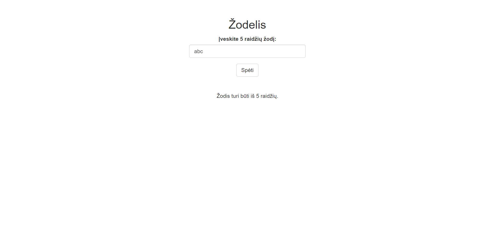
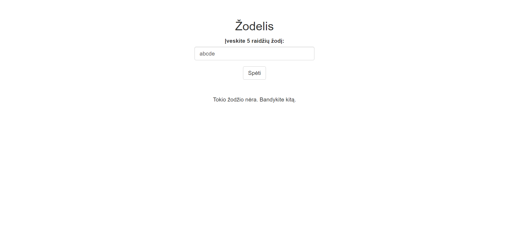

```{r, include = FALSE}
knitr::opts_chunk$set(
  collapse = TRUE,
  comment = "#>"
)
```

```{r setup}
library(zodelis)
```
# Žodelis

This is a package that contains the lithuanian version of Wordle, the famous New York Times game.

## How does the game work?

In this game you have to guess a lithuanian word that consists of 5 letters.
You have 6 guesses.

A single guess consists of a random 5-letter lithuanian word.
After each guess you receive feedback on whether you got any of the
letters or letters AND their positions right! Based on this,
update your guesses and try to win!

Could be a (extremely difficult) way to learn lithuanian!

## What do you need beforehand?

Software to be installed before use:
- RStudio
- Shiny

## How do I start?

Use this function to launch the game:
zodelis::launch_zodelis()

## Example on how to play

### Step 1:
You have to submit a 5-letter lithuanian word as a guess.
If your word does not contain 5 letters, you will receive this message:


If your word is not a valid word from the word list, you will receive this message:


If your word is from the word list, your guess will count and you will receive feedback, just like here:


### Step 2:
You should continue guessing by taking feedback into account. A grey letter means that the letter is not in the word. A yellow letter means that the letters is correct, however, in the wrong posiiton. A green letter means that both the letters and its position is correct.


### Step 3:
If you manage to guess the word right, you will receive this message:


You can restart the game and the "wins" counter will add a number to it.

### Step 4:
However, if you lose, you will receive this message:


You can restart the game, however, the "loss" counter will add a number to it as well.

### Step 5:
Have fun and keep guessing!

